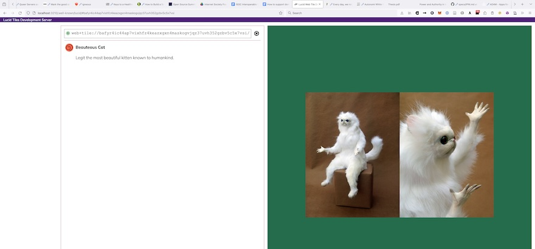
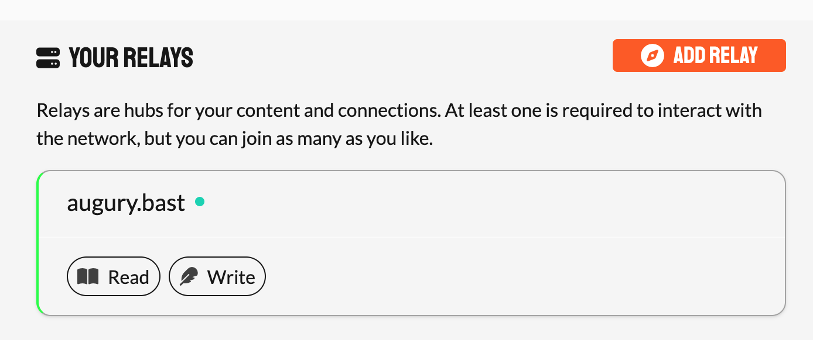
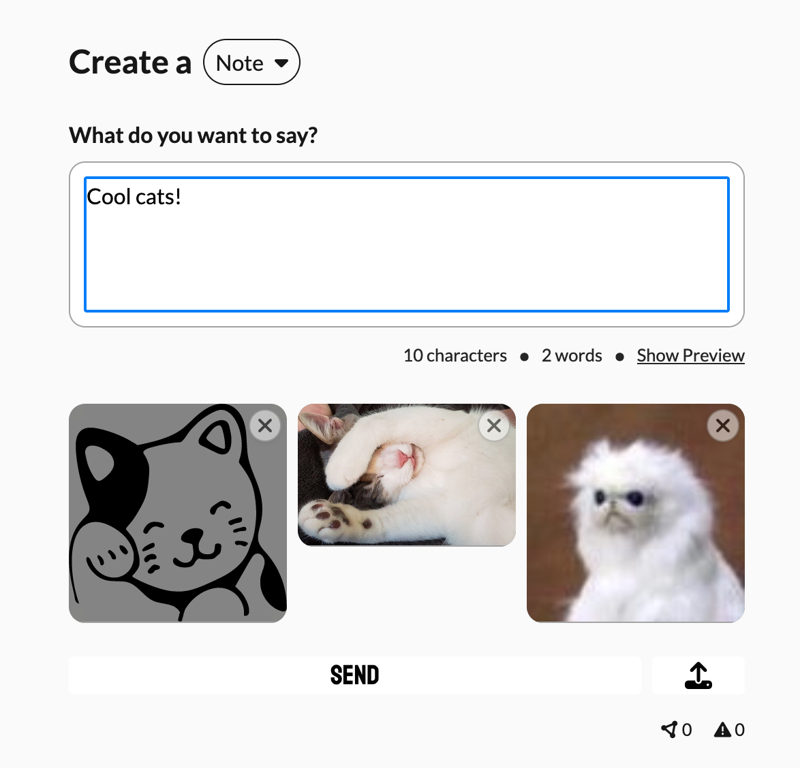
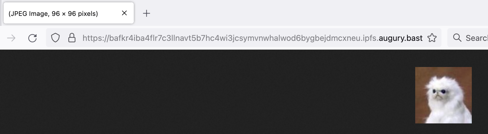

# LUCID — Lightweight Universal CIDs

The IPFS family of technologies contain a Petri dish of great ideas. However, many of them have a high
degree of optionality that can render interoperability challenging, and several were created in a way
that does not always mesh well with other parts of the wider web stack.

LUCID is an *experimental* project to subset and apply IPFS technologies in ways that are readily
interoperable, relatively easy to understand to newcomers, and that work well with the web as
generally practiced by developers. It gets its name because it first applies that logic to IPFS's
most foundational component, CIDs.

## LUCID Identitiers

[CIDs](https://github.com/multiformats/cid) (Content IDentifiers) are an excellent and highly-extensible
format for content-addressing. One aspect that is hampering their wider adoption is the wealth of 
options that they support and the accompanying complexity. LUCID is an experiment to see how small a
subset of that option space we can get away with supporting while working on key non-IPFS goals. LUCIDs
have two requirements:

1. They are fully compatible with CIDs: any off-the-shelf piece of software that reads CIDs will read
   LUCIDs with no modifications. This also means that LUCIDs retain CIDs' extensibility, they just don't
   make use of it just yet.
2. They support as few CID options as possible (though this set may grow as we explore the space more):
   1. Only v1, no v0.
   2. Only base32 multibase encoding (the `b` prefix) for the string, human-readable encoding.
   3. Only the raw-binary codec (`0x55`) and (maybe) dag-cbor (`0x71`).
   4. Only Blake3 hashes (`0x1e`).
   5. No blocks.
   6. This set of options has the added advantage that no varint processing is required.

This is a highly opinionated and arguably wrong set of options. No blocks means that big files are big 
and will need to be split at a separate layer if that is desirable (e.g. seekable video will need to
use MPEG-DASH or something similar).

One valuable property of LUCIDs is that they can be string-compared. They only need to parsed when there
is a need to access the codec or the hash.

Parsing and producing LUCIDs can be done using `cid.js`.

## Tiles

[Web Tiles](https://berjon.com/web-tiles/) are a simple format that can be used to build 
content-addressable web sites. At the root of a tile is a simple manifest that contains metadata about 
the tile, and a mapping from paths to CIDs (here to LUCIDs). Evidently, the path mapping can be
autogenerated.

Advantages of tiles include:

1. High security. It is impossible to load resources from outside the tile. This means that you can not
   only verify that the root of the tile you are getting is the one you expect to get, but also that all
   of its dependencies are as well. This also makes it private. This is a big improvement over web content.
2. Web pathing. Paths in IPFS can sometimes be confusing, and require supporting UnixFS, which also comes
   with its own dependencies. In HTTP, the path is not structured as a series of directories, it is just
   a string. The tiles approach mimics that so that it has direct, simple, 1:1 mapping from paths to 
   resources (and therefore to CIDs).
3. Media types. A lot of IPFS content doesn't have a MIME type attached to it, and that is often inferred
   at runtime, for instance by a gateways. This is problematic and introduces known security issues. With
   media types built in, tiles avoid this problem.

As a result, when you take a web app or page contained in a directory and you wrap it up as a tile, it
can just work and be safe, privacy friendly.

As currently implemented, this system does *not* allow calling any external APIs. There are ways of 
building that into a tile implementation, either by exposing a wallet API or by supporting intents/wishes.

The relevant code can be found in:

- `manifest.js`: manages the tile manifest
- `tile.js`: manages tiles
- `watcher.js`: watches a directory for changes, to keep producing a correct manifest for it

As a demo, the `lucid-dev-server.js` script can be used:

```
Usage: lucid-dev-server [options] <path>

Run a dev server for Web Tiles

Arguments:
  path           path to the directory to serve

Options:
  -V, --version  output the version number
  -p, --port     port
  -h, --help     display help for command
```

For instance, running `./lucid-dev-server.js demos/beautiful-cat/` will spin up a dev server at 
http://localhost:3210. Pointing your browser there will show a tile on the right as well as its
metadata on the left. If you then tinker with the code in `demos/beautiful-cat/`, the browser will
keep updating the LUCID that it is pointing to as the root of the tile and updating the tile.

(Note: Brave blocks some of this, for non-obvious reasons which I have yet to debug.)



## Caddify

[Caddy](https://caddyserver.com/) is a very cool server, that also happens to support a very
flexible [dynamic configuration API ](https://caddyserver.com/docs/api). What this command 
does is that, when pointed at a directory, it automatically configures a running Caddy instance
to serve the content of that directory via gateway endpoints.

The command is pretty simple:

```
Usage: caddify [options] <path>

Dynamically configure a Caddy server to serve IPFS

Arguments:
  path                   path to the directory to serve

Options:
  -V, --version          output the version number
  -e, --endpoint <url>   the Caddy endpoint for its configuration API (default: "http://localhost:2019/")
  -d, --domain <domain>  the domain under which to serve IPFS (default: "localhost")
  -p, --port <number>    the port from which to serve IPFS (default: 443)
  -o, --out <path>       path to save the config to instead of posting it
  -q, --quiet            shush (default: false)
  -h, --help             display help for command
```

Running it to configure and serve from the local Caddy:

```
[lucid 15:12 (main)] $ ./caddify.js demos/beautiful-cat/
Configuration updated:
- https://bafkr4igra3bh6uuhmtpwiymbipaodx3lxwupn3absumn6do234xupooice.ipfs.localhost/ ➯ /index.html
- https://bafkr4ickhymp67xqfakp4qysyep5hgwmul5lucymb7ttxfbaqkbuap355i.ipfs.localhost/ ➯ /cat.svg
- https://bafkr4idcy33utsake6atvbagnojkn7odp7mdo6n7tvspd4ndnewphj67xu.ipfs.localhost/ ➯ /wtf.jpg
```

## Nostr IPFS

The [high-level overview of the Nostr protocol](https://github.com/nostr-protocol/nostr) has this
opinionated statement about its architecture:

> It doesn't rely on any trusted central server, hence it is resilient; it is based on cryptographic keys and 
> signatures, so it is tamperproof; it does not rely on P2P techniques, and therefore it works.

I experimented with a Nostr integration because that aligns well with IPFS. IPFS is often thought of
as operating atop a DHT, but that is only *one* way of doing IPFS. As per the [IPFS Principles](https://specs.ipfs.tech/architecture/principles/),
IPFS is transport agnostic, and HTTP gateways are an excellent way of using IPFS.

In this repo, `augury.js` is a minimalistic but usable Nostr relay server. Its usage is simple:

```
Usage: augury [options]

An experimental Nostr server that integrates with IPFS

Options:
  -V, --version        output the version number
  -p, --port <number>  the port on which the WSS server runs (default: 6455)
  -c, --config <path>  a configuration file
  -s, --store          path to the directory in which the data is saved
  -l, --log-level      logging level (verbose|log|warn|error)
  -h, --help           display help for command
```

The configuration file is a JSON file that has the same options as the CLI above (with `logLevel` for `--log-level`)
as well as an extra `posters` field that is an array of Nostr pubkeys (formatted as they appear on Nostr events)
who are allowed to post to that server.

If you run `augury.js -c some/config.json`, then you'll have a Nostr relay server running. Because of some
annoyance with how web sockets work, it's better to run it not directly on `localhost` but using a local
wildcard domain name. I use `dnsmasq` to resolve `augury.bast` locally as well as a Caddy server configured thus:

```
https://*.tile.augury.bast, https://*.ipfs.augury.bast, https://*.augury.bast, https://augury.bast {
	tls internal {
		on_demand
	}
	reverse_proxy http://localhost:6455
}
```

(You might get away with `internal` instead of `on_demand`.)

This Augury Nostr relay server has extras compared to regular Nostr relays:

- It has an extension to [NIP-94](https://github.com/nostr-protocol/nips/blob/master/94.md) that supports a
  `cid` tag on resource metadata to capture the CID for a resource.
- It has an extension to [NIP-96](https://github.com/nostr-protocol/nips/blob/master/96.md) that conveys the
  fact that a NIP-96 endpoint is IPFS compatible (it adds an `ipfs: true` field).

These features were designed and implemented so that they add IPFS support to Nostr while creating the smallest
amount of difference possible. And, importantly, *no change to the Nostr client is needed*. Essentially:

- NIP-96 works as usual.
- The preference is to expose IPFS CIDs at subdomain gateways (`https://<CID>.ipfs.<DOMAIN>/`), which NIP-96
  doesn't immediately support (it expects the resources to live as sub-paths of the defined API URL). In order
  to bridge the two, this exposes the usual operations on the sub-path of the API URL, but redirects (308) the
  `GET` operation to the corresponding IPFS subdomain gateway.

Inside `coracle` is a lightly modified [Coracle](https://github.com/coracle-social/coracle) client that can 
be used to interface with this Nostr relay. (The only modification is that Coracle bails if you lack a Dufflepud 
preview server, this falls back to just using the original file.) Run it with `yarn dev` in the subdirectory.
(Another Nostr client should just work as well.)

Configure your local relay in the client:



Create a post with attachments:



The images are available at a subdomain gateway URL:


